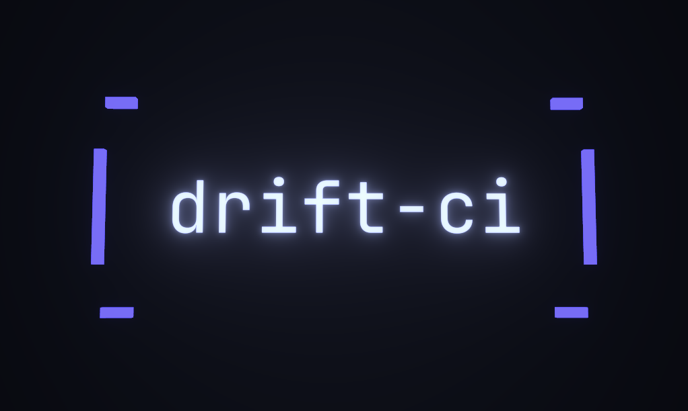

<p align="center">
  
</p>

<p align="center">
  <em>Catch LLM behaviour regressions in CI, before they ship.</em>
</p>

<p align="center">
  <a href="https://github.com/Drift-CI/drift-ci/actions/workflows/ci.yml"></a>
  <a href="https://www.npmjs.com/package/@drift-ci/cli"></a>
  <a href="https://github.com/marketplace/actions/drift-ci"></a>
  <a href="LICENSE"></a>
</p>

---

LLM applications drift. A reworded prompt, a model upgrade, or a bumped dependency can silently change what your app says — and unlike code, there's no compiler or unit test to catch it.

**drift-ci** makes prompt behaviour **testable**: define cases with expected outputs, score them against your provider on every pull request, and **block the merge** when behaviour drifts past a threshold — with baselines committed as code and a diff-style PR comment.

**What it is** — a CI-time gate for LLM behaviour: shift-left tests for prompts, with git-committed baselines and a pull-request workflow.

**What it isn't** — production observability, tracing, or a prompt-management UI. drift-ci complements eval frameworks like [Promptfoo](https://www.promptfoo.dev) and [DeepEval](https://github.com/confident-ai/deepeval) by being opinionated about the **CI gate** and the **baselines-as-code** workflow, rather than one-off eval runs.

## Quick start

Requires Node.js 22+.

```bash
# 1. Scaffold .drift/config.yaml + .drift/suite.yaml
npx @drift-ci/cli init

# 2. Run the suite against your provider
npx @drift-ci/cli run

# 3. Inspect the diff, accept intentional changes, and commit them as code
npx @drift-ci/cli baseline accept
git add .drift/baseline && git commit -m "accept baseline updates"
```

A minimal `.drift/suite.yaml`:

```yaml
version: 1
id: greetings
name: Greetings
evaluators: [exact-match]
cases:
  - id: hello
    input: Say hi.
    expected: Hi!
```

## In CI (GitHub Action)

```yaml
- uses: Drift-CI/drift-ci@v1
  with:
    provider: anthropic
    api-key: ${{ secrets.ANTHROPIC_API_KEY }}
  env:
    GITHUB_TOKEN: ${{ secrets.GITHUB_TOKEN }}
```

On every pull request, the action runs your suite and posts a regression/improvement table as a single, idempotent comment. Full inputs and outputs — plus the fork-PR safety pattern — are in the [action README](packages/action/README.md); ready-made workflows (basic, matrix, fork-gated, GitLab CI) live in [examples/workflows/](examples/workflows/).

## How it works

1. **Run** — each case is sent to the configured provider; the response is scored by the evaluator chain.
2. **Compare** — scores are diffed against the committed baseline at `.drift/baseline/<case-id>.json`.
3. **Decide** — a regression (a score drop past your threshold) exits `1` and fails the build. A transient-error storm (rate limits, timeouts) exits `2` instead — never mistaken for a regression.
4. **Accept** — intentional changes are promoted with `drift-ci baseline accept` and committed alongside the code change, reviewed as a diff.

## Features

- **Providers** — Anthropic, OpenAI, Azure OpenAI, Bedrock, Google Gemini, Vertex AI, and Ollama (local + cloud).
- **Evaluators** — exact-match, json-schema, cosine-similarity (embeddings), LLM-judge, refusal-detection, rubric-checklist, and safety-classifier.
- **Baselines as code** — one git-committed JSON file per case, with secret redaction before anything reaches disk.
- **Reporters** — live terminal (Ink), pipe-safe text, JSON, and JUnit XML.
- **Run history** — in-memory, SQLite, Postgres, or HTTP sync to the dashboard.
- **GitHub Action** — native JavaScript (no Docker), idempotent PR comments, a fork-PR safety gate, and JUnit output.
- **Self-hostable dashboard** — run history, drift timelines, provider comparison, OAuth + RBAC, and alerts via Slack / Teams / PagerDuty / email / webhook.

## Design notes

A few load-bearing decisions worth knowing:

- **Baselines are git-committed files, not database rows.** Accept locally, commit, and review them as a diff — there's no "promote" button or hidden server state.
- **Transient errors are never regressions.** Rate limits and network failures get dedicated statuses and their own exit code.
- **Secrets are redacted before baselines are written.** Baselines live in git, so nothing sensitive may ever reach disk.

See [docs/drift-ci-architecture.md](docs/drift-ci-architecture.md) for the full design rationale.

## Documentation

- [Architecture reference](docs/drift-ci-architecture.md) — what drift-ci is, and why.
- [Self-hosting guide](docs/self-hosting.md) — bring up the dashboard and Postgres with Docker Compose.
- [Reverse-proxy hardening](docs/reverse-proxy.md) — TLS and forwarded headers behind nginx / Caddy / Traefik.

## Contributing

Contributions are welcome — see [CONTRIBUTING.md](CONTRIBUTING.md) for the development workflow, commit conventions, and sign-off.

## Security

Report vulnerabilities via [SECURITY.md](SECURITY.md). Please don't open public issues for security reports.

## License

[MIT](LICENSE) © drift-ci contributors
